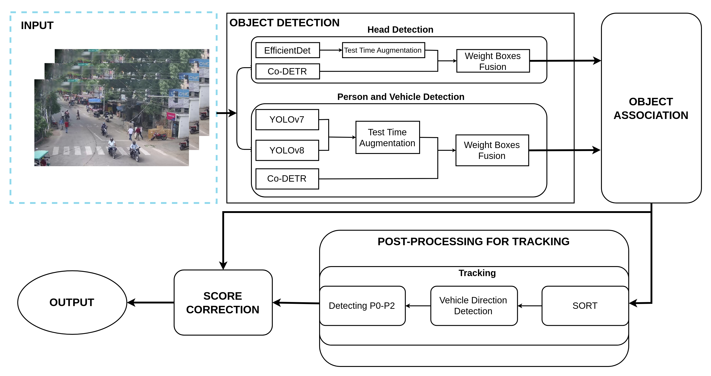

# AICITY2024_Track5
This repo includes solution for AICity2024 Challenge Track 5 - Detecting Violation of Helmet Rule for Motorcyclists


# Installation
Python 3.9 or later with dependencies listed in requirements.txt. Run the below command for install dependencies:
```commandline
pip install -r requirements.txt
```
# Data Preparation For Training
Download the training data v1 and put the download file into ./training/aicity_dataset/detection_training/, can be downloaded here

Download the training data v2 and put the download file into ./training/aicity_dataset/detection_training/, can be downloaded here

In the video dataset, which we've broken down into frames that can be downloaded here

# Reproduce the result on AICity 2024 Challenge Track 5
Our solution implemented in 3 steps

## STEP 1 - Baseline training
### Train
#### YOLOv8
```commandline
cd training/ultralytics
python train.py
```
##### Note: We execute the training with 8 NVIDIA RTX 2080TI 12GB GPU

#### YOLOv7
```commandline
cd training/yolov7
python -m torch.distributed.launch --nproc_per_node 8 --master_port 9527 train.py --workers 8 --device 0,1,2,3,4,5,6,7 --sync-bn
```
##### Export YOLOv7 to onnx
```commandline
cd training/yolov7
python export.py --weights ../weights/yolov7-d6_data_v1/weights/best.pt --grid --end2end --simplify --topk-all 300 --iou-thres 0.65 --conf-thres 0.01 --img-size 1280 1280 --max-wh 1280
```
##### Note: We execute the training with 8 NVIDIA RTX 2080TI 12GB GPU

#### Co-DETR
......

......
##### Note: We execute the training with one DGX node with 4 NVIDIA A100-40GB GPU

### Inference
#### Inference model YOLO
```commandline
python inference_model_yolo.py
```
After running the executable, the resulting file will be saved in the ./results_detection


#### Inference model Co-DETR
....

#Convert format json to txt aicity

....

After running the executable, the resulting file will be saved in the ./results_detection

## STEP 2 - Head training
Download the training data zip file and extract it inside ./training/aicity_dataset/head_training/datasets/

### Co-DETR
#### Train
....
#### Inference
....

After running the executable, the result file will be received as a result_head_codetr.txt in the ./results_head

### EfficientDet
#### Train
Please correct the data path in the file config ./head_training/.....
```commandline
cd training/head_training
python effdet_train.py
.....
```
#### Inference
```commandline
python predict.py
```
After running the executable, the result file will be received as a result_head_effdet.txt in the ./results_head

## STEP 3 - Full pipeline
In this step, we used the resulting files of step 1, step 2, module object association and module score correction to get the final result

Please correct the resulting file path in full_pipeline.py

```commandline
python full_pipeline.py
```


## Public Leaderboard
| TeamName    | mAP    |
|-------------|--------|
| **VNPT AI** | 0.4792 |


## Citation

If you find our work useful, please cite the following:

```text
@inreview{Duong2024,  
    author={Thien Van Luong and Huu Si Phuc Nguyen and Duy Khanh Dinh and Viet Hung Duong and Duy Hong Sam Vo and Huan Vu and Minh Hoang Tuan and Tien Cuong Nguyen},  
    title={Motorcyclist Helmet Violation Detection Framework by Leveraging Robust
Ensemble and Augmentation Methods},  
    booktitle={CVPR Workshop},
    year={2024}  
}
```

## Contact
Thien Van Luong (thien.luongvan@phenikaa-uni.edu.vn)

Huu Si Phuc Nguyen (phucnhs@vnpt.vn)

Duy Khanh Dinh (khanhdd@vnpt.vn)

Viet Hung Duong (hungdv@vnpt.vn)

Duy Hong Sam Vo (samvdh@vnpt.vn)

Huan Vu (huan.vu@utc.edu.vn)

Minh Hoang Tuan (tuanhgm@vnpt.vn)

Tien Cuong Nguyen (cuongnt@vnpt.vn)